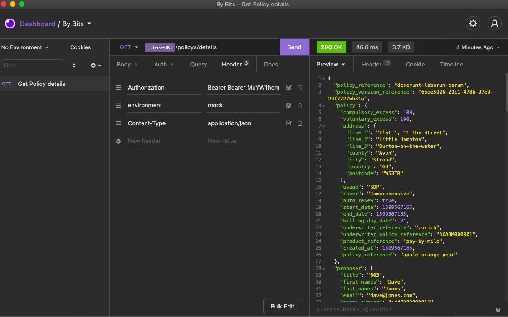

# By-Bits-Test

React front-end App

In this test, I was tasked with creating a simple web application.

- It had to have a login screen which takes a username and password.

- Once authorised, it should navigate the user to another page which will display policy details.

- Use the two Policy API endpoint

### Dependencies:

Used create react app with GA template:

npx create-react-app project-name --template cra-template-ga-ldn-projects


yarn add:

- axios
- react-router-dom


### Planning and using Insomnia:

Having decided to do the task using React, I began with using Insomnia. This was to visualise the requirements for the requests and to check if everything working fine before attempting to implement these in my project. By doing this, it meant that had I run into a error when trying to access the API's within my project that I knew this was an error of my own. Having done this I began to set out the basic structure of my app. Using react-router-dom to create a multi page app I planned my nessisary components creating the most basic of react-components to check they were working ok before moving on.




### Lib api.js and auth.js

Having created the basic structure needed for the App I began to build the API requests. Using axios to help I built out both the getDetails and loginUser functions. Having earlier visualised what headers the request needed I was able to create a headers function so that I could pass the information with the request. Having thought that the Authorization was nessisary for the get request I set about building the functions nessisary to set and get the token in auth.js. This would be set when the request was called in Login.js and therefore if the user tried to access the page through the URL without logging in the token wouldn't match and it would fail. This method worked, however when trying to access the page without the token through the URL it didn't stop me like I expected. Going back to Insomnia I toggeled the Authorization header off and to my suprise the request still went through. This 

```JavaScript
// Capturing the formdata and logging In

const [formdata, setFormdata] = React.useState({
    username: '',
    password: '',
    type: 'USER_PASSWORD_AUTH',
  })

  const handleChange = event => {
    const nextState = { ...formdata, [event.target.name]: event.target.value }
    setFormdata(nextState)
  }

  const handleSubmit = async event => {
    event.preventDefault()

    try {
      const { data } = await loginUser(formdata)
      setToken(data.access_token)
      history.push('/policy-details')
    } catch (err) {
      console.log('error')
    }
  }
```

### Wins


### Major hurdles and unsolved problems


### Key Learning


### Future Features


