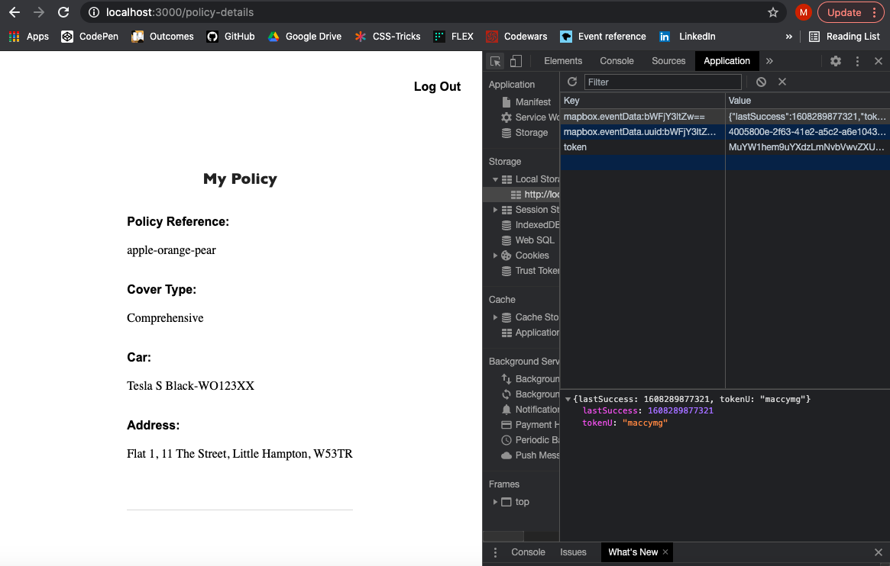
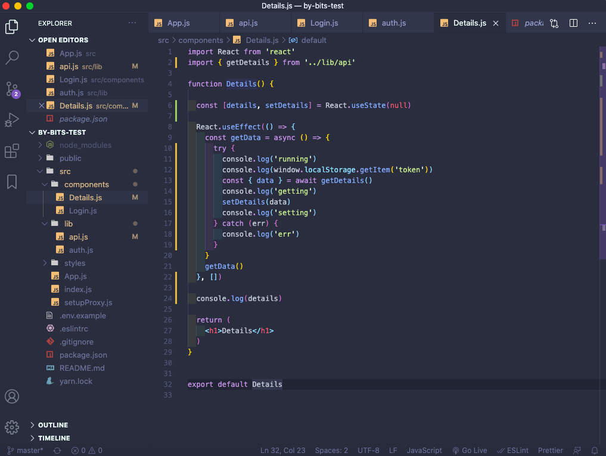

# By-Bits-Test

React front-end App

In this test, I was tasked with creating a simple web application.

- It had to have a login screen which takes a username and password.

- Once authorised, it should navigate the user to another page which will display policy details.

- Use the two Policy API endpoint


### Dependencies:

Used create react app with GA template:

npx create-react-app project-name --template cra-template-ga-ldn-projects


yarn add:

- axios
- react-router-dom


### Planning and using Insomnia:

Having decided to do the task using React, I began with using Insomnia. This was to visualise the requirements for the requests and to check if everything working fine before attempting to implement these in my project. By doing this, it meant that had I run into an error when trying to access the API's within my project that I knew this was an error of my own. Having done this, I began to set out the basic structure of my app. Using react-router-dom to create a multi-page app I planned my necessary components creating the most basic of react-components to check they were working ok before moving on.


### Lib api.js and auth.js

```JavaScript
// api.js

import axios from 'axios'
import { getToken } from './auth'

const baseUrl = 'https://api.bybits.co.uk'

function headers() {
  return {
    headers: { 
      Authorization: `Bearer ${getToken()}`,
      environment: 'mock',
      ContentType: 'application/json',
    },
  }
}

export function getDetails() {
  return axios.get(`${baseUrl}/policys/details`, headers())
}

export function loginUser(formdata) {
  return axios.post(`${baseUrl}/auth/token`, formdata, headers())
}
```

Having created the basic structure needed for the App I began to build the API requests. Using axios to help I built out both the getDetails and loginUser functions. Having earlier visualised what headers the request needed I was able to create a headers function so that I could pass the information with the request. Having thought that the Authorization was necessary for the get request I set about building the functions necessary to set and get the token in auth.js. This would be set when the request was called in Login.js and therefore if the user tried to access the page through the URL without logging in the token wouldn't match and it would fail. This method seemed to have worked having used the console to check the token in local storage, however when trying to access the page without the token through the URL it didn't stop me like I expected. Going back to Insomnia I toggled the Authorization header off and to my surprise the request still went through. This was an error with the API as it in fact doesn’t require an authorization header with the token explained in the instructions. Keeping the same method, I added in a condition when accessing the API in Details.js to nullify this mistake and make it work. This is something that would need fixing if it wasn’t a mock API.




```JavaScript
// Capturing the formdata and logging In

const [formdata, setFormdata] = React.useState({
    username: '',
    password: '',
    type: 'USER_PASSWORD_AUTH',
  })

  const handleChange = event => {
    const nextState = { ...formdata, [event.target.name]: event.target.value }
    setFormdata(nextState)
  }

  const handleSubmit = async event => {
    event.preventDefault()

    try {
      const { data } = await loginUser(formdata)
      setToken(data.access_token)
      history.push('/policy-details')
    } catch (err) {
      console.log('error')
    }
  }
```

### Debugging

Having built out the Login components form in jsx I began on the functionality. As seen above I was able to write the necessary state and functions to capture, update and send the formdata to the loginUser function. Now I had the login working as I would have liked, I set about accessing the policy data. Here I ran into an issue. Having got the basics needed set up I was getting an error in the console. As seen bellow, using my console logs I was able to determine as I thought, that there was something wrong with my getDetails function in api.js. I was initilly sure that this was an error with how I was passing the headers, but using Insomnia again I was able to remove this possibility. It was in fact a simple human error that I was using the post method instead of get. By planning and removing the possibility of other errors I was able to see my own error quicker and save me time.




### Final features and styling

Having then built out the Details page using the conditional to check for the data before accessing its properties I began adding last features such as the logout option and styling. Having though about using Material UI having used this previously, I decided that as there wasn't a huge amount to do that I would just use regular CSS. Using a Sass styled form that I has used previously to save time I added CSS styling to the rest of the application to give it a basic but clean look.


### Wins

This was a really fun challange as it tested lots of different aspects of API's and front-end coding and it was nice not to have to worry about the back-end for once.


### Future Features

Future features include error handling so that the catch part of the try catch actually throws an error rather than just console logging them. Error handling would also give you access to send information back to the user say if the requirements for logging in didn't accept everything when you have added a backend with a user model. This would then allow you to tell the user if their username was wrong for example. Adding a register page. Using a token where it is possible to determine the time it was created and then creating the functionality to make the token expire after a certain period of time meaning a user doesn't stay signed in forever. Similarly building out the details page to give the user more information about their policy as well as spending more time on styling.


